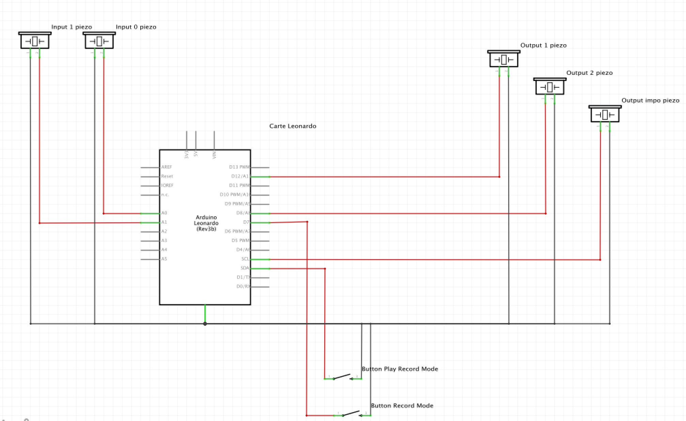

# DrumDuino

## Description
DrumDuino est drumkit à base de piezos permettant de créer un rythme et de l'enregister sur un Arduino Leonardo. Sur ce rythme sera ensuite jouer une suite de notes en improvisation.

Il est composé de deux piezos en entré qui lors d'un contact jouent un son sur les piezos en sortie. Il est ensuite possible via un bouton de passer en mode enregistrement.
Avec un autre bouton il est possible d'écouter son enregistrement avec une mélodie improvisée sur une gamme de note définie en avance.

## Schéma Circuit


## Code Arduino

### Record State

```C
void changeState() {
  if (previousMillisInterup >= intervalInterupt) {
    if (currentState == RECORDING) {
      currentState = FREE_PLAY;
      Serial.println("Switch recording OFF");
    } else {
      currentState = RECORDING;
      Serial.println("Switch recording ON");
    }
  }
  previousMillisInterup = 0;
}
```
Cette fonction est appellée par l'interruption suivante, au moment du clic sur le bouton record mode
```C
  attachInterrupt(digitalPinToInterrupt(recordPin), changeState, LOW);
```
---

### Play Record State

```C
void togglePlayRecorded() {
  if (previousMillisInterup >= intervalPlayInterupt) {
    if (currentState == RECORD_PLAYING) {
      currentState = FREE_PLAY;
      Serial.println("Switch stopped playing recorded track");
    } else {
      currentState = RECORD_PLAYING;
      Serial.println("Switch started playing recorded track");
    }
  }
  previousMillisInterup = 0;
}
```
Cette fonction est appellée par l'interruption suivante, au moment du clic sur le bouton play record mode

```C
  attachInterrupt(digitalPinToInterrupt(recordPin), changeState, LOW);
```
---

### Play buzzer
Ces deux fonctions de changement d'état permettent ensuite au code de gérer les différents cas comme dans la fonction play buzzer

```C
void playBuzzer(int buzzerOutputPin, unsigned int frequency, unsigned long duration, unsigned long currentMillis) {
  if (lastBuzzerPinToned != 0) {
    noTone(lastBuzzerPinToned);
  }
  switch (currentState) {
    case RECORDING:
      if (previousMillisRecord >= intervalRecord) {
        records[recordsCount] = buzzerOutputPin;
        recordsTimer[recordsCount] = currentMillis;
        recordsCount++;
        previousMillisRecord = 0;
      break;
    case FREE_PLAY:
      break;
    case RECORD_PLAYING:
      break;
    default:
      break;
  }

  tone(buzzerOutputPin, frequency, duration);
  lastBuzzerPinToned = buzzerOutputPin;
}
```

## Optimisation possible

- Utilisation de la librairie JS [Tonal](https://github.com/danigb/tonal) pour créer des improvisations sur de nombreuses gammes différentes.
- Utilisation de mozzi pour créer des sons plus ressemblants que les beepers par défaut.
- Trouver un moyen de jouer par dessus le record.
